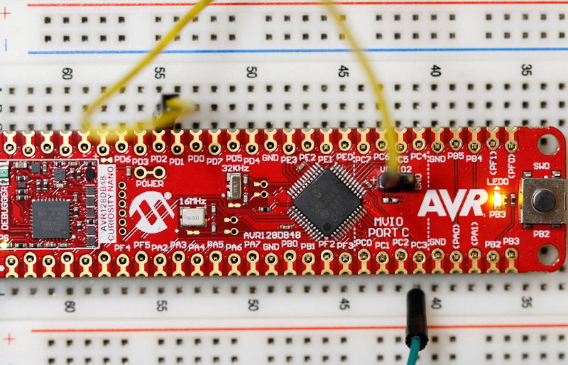

<!-- Please do not change this logo with link -->

# Pulse Amplitude Modulation with AVR128DB48
Pulse Amplitude Modulation (PAM) is a type of mixed (analog and digital) signal that incorporates pulsed outputs similar to Pulse-Width Modulation (PWM), but with varying levels or waveforms in the signal, rather than a constant DC level. To create this output, the Multi-Voltage I/O (MVIO) feature on AVR® DB was used along with the Digital-to-Analog Converter (DAC), OPAMP, Timer/Counter B (TCB), Configurable Custom Logic (CCL), and Timer/Counter D (TCD) peripherals.

## Related Documentation

- [Video: Multi-Voltage I/O (MVIO) on 8-bit Microcontrollers (Part 1)](https://www.youtube.com/watch?v=RSpu1iM-hT8)
- [Video: Powering Multi-Voltage I/O with the OPAMP (Part 2)](https://www.youtube.com/watch?v=1fXWp-ix8JE)
- [AVR128DB48 Product Page](https://www.microchip.com/wwwproducts/en/AVR128DB28?utm_source=GitHub&utm_medium=TextLink&utm_campaign=MCU8_MMTCha_avrdb&utm_content=avr128db48-pam-generator-mplab)

## Software Used

 - [MPLAB® X IDE v5.45 or newer](https://www.microchip.com/en-us/development-tools-tools-and-software/mplab-x-ide?utm_source=GitHub&utm_medium=TextLink&utm_campaign=MCU8_MMTCha_avrdb&utm_content=avr128db48-pam-generator-mplab)
 - [MPLAB XC8 v2.31 or newer](https://www.microchip.com/en-us/development-tools-tools-and-software/mplab-xc-compilers?utm_source=GitHub&utm_medium=TextLink&utm_campaign=MCU8_MMTCha_avrdb&utm_content=avr128db48-pam-generator-mplab)
 - [MPLAB Code Configurator (MCC) v5.0.2 or newer](https://www.microchip.com/mplab/mplab-code-configurator?utm_source=GitHub&utm_medium=TextLink&utm_campaign=MCU8_MMTCha_avrdb&utm_content=avr128db48-pam-generator-mplab)
 - [MPLAB Code Configurator (MCC) Device Libraries 8-bit AVR MCUs v2.7.0](https://www.microchip.com/mplab/mplab-code-configurator?utm_source=GitHub&utm_medium=TextLink&utm_campaign=MCU8_MMTCha_avrdb&utm_content=avr128db48-pam-generator-mplab)
 - [Microchip AVR-Dx Series Device Support (v1.4.109) or newer](https://packs.download.microchip.com/)

## Hardware Used

- [AVR DB Curiosity Nano (P/N: EV35L43A)](https://www.microchip.com/DevelopmentTools/ProductDetails/PartNO/EV35L43A?utm_source=GitHub&utm_medium=TextLink&utm_campaign=MCU8_MMTCha_avrdb&utm_content=avr128db48-pam-generator-mplab)
- Oscilloscope (Bandwidth of at least 100kHz)

## Setup

To create this demo, the only required connection is from the output of the OPAMP (PD2) to the MVIO Power Supply (VDDIO2). If this connection is not made, the pins on the MVIO port will remain at a high-impedance.

For information about enabling MVIO on the Curiosity Nano, please see **section 5.1.3** in the [AVR128DB48 Curiosity Nano Hardware User Guide (DS50003037A)](https://ww1.microchip.com/downloads/en/DeviceDoc/AVR128DB48-Curiosity-Nano-HW-UserG-DS50003037A.pdf).

The waveform output is on pin PC3. Other pins on PCx will also have the waveform superimposed on their output levels, if enabled as outputs. (Inputs will be affected by the changing levels, which changes the thresholds for digital logic.)

## Operation

This program can be divided into 2 parts - a PWM generator and an Arbitrary Waveform Generator (AWG). The AWG is buffered by a voltage follower (Unity Gain) OPAMP and is used to power the MVIO port. In order to prevent the MVIO from shutting down, the supply voltage should always be 1.62V or higher.

### PWM Generator

The PWM generator was created using the Timer-Counter D peripheral in single-slope mode with a period of 4us and a 50% duty cycle at 250kHz. However, the TCD peripheral does not have an output on PORT C. To get the output to PORT C, the CCL peripheral was used to output a mirrored copy of the signal on PC3.

### AWG Design

The AWG implemented on the AVR DB has the following types of outputs:

- Direct Current (DC)
- External Function
- Triangle Output
- Sawtooth
- 1kHz Sine (fixed amplitude and frequency)

*Note: The DC and External Function modes have the same initialization in software, with the naming only being for developer reference.*

The DAC has a *typical* setting time between 7 and 10us. During settling, the value of the DAC should not be changed. The TCB peripheral is used to generate a 10us periodic interrupt. MPLAB Code Configurator (MCC) generates a generic TCB interrupt function, which contains a function pointer to invoke custom code without modifying the generated API. Through this mechanism, the function ` __ISR__UpdateDAC` is invoked.

Inside `__ISR__UpdateDAC`, the routine checks to see if it's own internal function pointer to a waveform calculation function is not NULL. If valid, then the function pointer is invoked. This internal function pointer calls functions in the format of `uint16_t <FUNCTION NAME> (uint16_t currentDACOutput)`, where the returned value is assigned to the DAC.

At initialization, internally used variables and the DAC initial values are set. The table below shows the macros and their associated variable.

| Macro name              | Default Value       | Variable    | Description
| ----------------------- | ------------------- | ----------- | ------------
| INIT_MINIMUM_OUTPUT     | 369                 | minValue    | Sets the lowest output value for the DAC (default ~1.8V at Vdd = 5V).
| INIT_MAXIMUM_OUTPUT     | 0x3FF               | maxValue    | Sets the highest output value for the DAC (defaults to full-scale).
| INIT_RATE_OF_CHANGE_POS | 2                   | rampRatePos | Sets the rising rate of change for the triangle and sawtooth functions.
| INIT_RATE_OF_CHANGE_NEG | 10                  | rampRateNeg | Sets the falling rate of change for the triangle function.
| INIT_DAC_OUTPUT         | INIT_MINIMUM_OUTPUT | DAC0.DATA   | Sets the initial value of the DAC.

*Note: The 1kHz sine function does not utilize the max and min output constants, see the sine section below for more info.*

The parameter passed to `initWaveformControl(WAVEFORM_OUTPUT)` is used to set the function pointer. The different waveforms are enumerated as follows:

- *DC* to `DC`
- *External Function* to `EXT_FUNC`
- *Triangle* to `TRIANGLE_RISING` (or `TRIANGLE_FALLING`, depending on DAC initial conditions)
- *Sawtooth* to `SAWTOOTH`
- *1kHz Sine* to `SINE_1K`

The waveform function can be changed at runtime by calling `setWaveformFunction(_WaveformISR)` and passing a waveform function.

### Output Types

---  

#### DC

In this mode, the DAC level is static and unchanging. The DAC interrupt does not trigger a function call to calculate a new value. `INIT_DAC_OUTPUT` should be used to set the DAC to the appropriate level at runtime, or alternatively, `DAC0_SetOutput(dac_resolution_t value)` can be called from main. See `main.c` for more information.

**In this mode, the output levels of the MVIO port are fixed. The output is not PAM in this mode.**

#### External Function

This mode is provided for developers to connect an external function to the example without the need to modify the inner workings. To demonstrate this, a function was implemented in `main.c` to change the DAC value by a factor that increments by 1 each time (e.g.: start + 1, start + 3, start + 6).

To properly use the demo function, uncomment `setWaveformFunction(&customBehaviorFunction)` in `main.c`.

#### Triangle

The triangle output is split into 2 functions - a rising edge and a falling edge. The rising edge function increments the DAC by an `rampRatePos`, while the falling edge decrements the DAC by an (unsigned) `rampRateNeg`. When the DAC reaches `maxValue`, the function pointer is internally reassigned to the falling edge function. The falling edge function runs until the DAC value reaches `minValue`, where the pointer is reassigned to the rising edge.

#### Sawtooth

The sawtooth output is a simplified version of the triangle function. The DAC value is incremented by `rampRatePos` until it reaches `maxValue`. Then, the function resets to `minValue`.

#### 1kHz Sine

The 1kHz sine wave output is generated by an embedded sine lookup table in memory. This removes the complicated math required to generate a good quality sine wave, at the cost of memory usage and fixed waveform parameters.

**The amplitude and frequency are fixed values, and cannot be modified without regenerating the sine table.**  

## Summary

This code example demonstrates a non-standard use of the MVIO peripheral to generate PAM waveforms by leveraging the wide variety of internal peripherals present on AVR DB.
